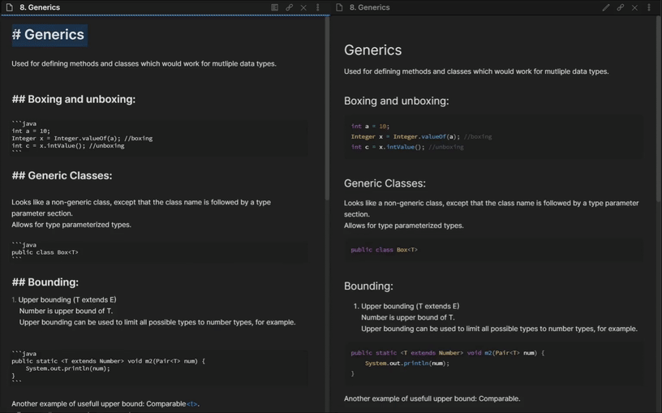

# Obsidian in Colour

This package is meant to work in combination with Obsidian - the application for note taking.

## Functionality:



Query is activated by the keyword `:col `, after which the user is asked for a colour and a text size using espanso forms.

The colour and size are then looked up in a local dictionary, if there is a match the property is replaced with the corresponding value. If no match is found the form inputs are left as is. 
This is useful for colour if one might want to use a specific value.

The dictionaries can be found in the python file "obsidian_colour.py", which every user should customise to their own needs.

## Installation
Make sure you have already installed [Espanso](https://espanso.org/install/) first.
```
espanso install obsidian-in-colour
espanso restart
```
Make sure to create a `scripts` directory in the `espanso` directory and store the **obsidian_colour.py** script there.